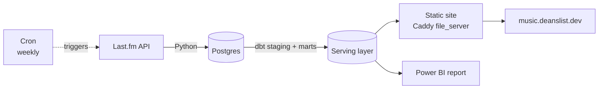

# music-growth-pipeline

A data pipeline + dbt project + public web app built on Last.fm data, tracking listener growth for artists over time.

[](https://music.deanslist.dev)


## The Finding

Across 37,435 artists tracked in weekly snapshots from 2026-05-10, **median listener growth increases with starting audience size** while the **smallest artists carry the largest average growth**, driven by a fat right tail:

| Quintile (smallest → largest) | Q1 | Q2 | Q3 | Q4 | Q5 |
|---|---|---|---|---|---|
| Median growth | 0.63% | 0.72% | 1.20% | 1.99% | **2.12%** |
| Average growth | **58.36%** | 3.70% | 3.44% | 3.13% | 2.78% |
| P90 growth | 4.71% | 8.80% | **9.33%** | 7.19% | 5.39% |

Most small artists barely move, but the ones that break out grow explosively. Q1's average is 27× its median. Explore the full breakdown by artist, genre, and size band on the [live site](https://music.deanslist.dev).

## Architecture



The API only returns cumulative all-time stats, so the pipeline snapshots each artist weekly and builds a longitudinal dataset via dbt. The web app and Power BI report read from a narrow, pre-joined serving layer — never directly from the marts.

## Tech Stack

| Layer | Tool |
|---|---|
| Data source | Last.fm API (read-only, key auth) |
| Ingestion | Python |
| Storage | Postgres (self-hosted) |
| Transformation | dbt (dbt-postgres) |
| Automation | Cron (weekly, on-server) |
| Reporting | Power BI (live Postgres connection) |
| Web app | HTML / Tailwind CSS / vanilla JS |
| Hosting | Hetzner Cloud behind Caddy (auto-HTTPS, static file_server) |

## Data

- **37,435 artists** — 9,808 charted (seeded from Last.fm's top 10,000), 27,628 unranked (seeded via genre tags and the similarity graph)
- **Weekly snapshots** from 2026-05-10 onward (stable population)
- Artists are classified by `size_band` (listener-count buckets from `<10k` to `1M+`), not chart position

## Repository Layout

```
pipeline/   Python ingestion — shared db.py / lastfm.py, seed scripts,
            weekly snapshot job, portfolio stats generator
dbt/        dbt project — models/, analyses/, tests/, seeds/, macros/
sql/        schema.sql (idempotent) + migrations/
docs/       Findings log, web app implementation plan
data/       pipeline_stats.json (consumed by deanslist.dev at build time)
web/        Static site — HTML, Tailwind CSS, vanilla JS
```

## Setup

```bash
git clone https://github.com/your-username/music-growth-pipeline
cd music-growth-pipeline
python3 -m venv .venv && source .venv/bin/activate
pip install -r requirements.txt

cp .env.example .env   # add LASTFM_API_KEY and DATABASE_URL
psql $DATABASE_URL -f sql/schema.sql

python pipeline/seed_artists.py              # pages 500-2000
python pipeline/seed_artists.py --start 1 --end 50   # mainstream baseline
python pipeline/snapshot_artists.py
python pipeline/seed_genre_artists.py
python pipeline/seed_similar_artists.py

dbt run --project-dir dbt
```

## Automation

A cron job on the Hetzner server runs every Sunday at 9 AM UTC (`weekly_snapshot.sh`):
1. `snapshot_artists.py` — snapshots all artists
2. `dbt run` — rebuilds all models
3. `generate_stats.py` — writes `data/pipeline_stats.json`
4. `export_json.py` — exports serving-layer data as JSON for the static site
5. `git push` — commits the updated stats JSON

[music.deanslist.dev](https://music.deanslist.dev) is served by Caddy as a static site and reflects new data after the weekly export. Deploy with `./deploy.sh`.

## What's Next

- **Deeper longitudinal data** — snapshots continue accumulating weekly; more weeks will strengthen findings and surface longer-term trends
- **Similarity network vs growth** — do smaller artists with more cross-band connections grow faster? Currently limited by sparse similarity data for the highest-growth artists
