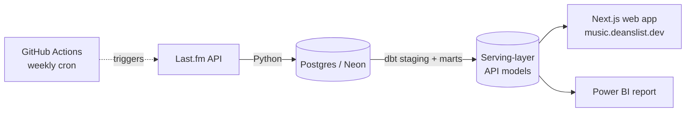

# music-growth-pipeline

**Do smaller artists grow their listener base faster than larger ones?**
A data pipeline + dbt project + public web app built on Last.fm data to find out — and a portfolio piece demonstrating SQL depth and data engineering fundamentals.

[](https://music.deanslist.dev)


## The Finding

Across 21,732 artists tracked over 15 weekly snapshots, **median listener growth falls monotonically with starting audience size**:

| Quintile (smallest → largest) | Q1 | Q2 | Q3 | Q4 | Q5 |
|---|---|---|---|---|---|
| Median 15-week growth | **3.02%** | 2.66% | 2.27% | 1.94% | **1.89%** |

No reversals at any step. Smaller artists also carry a much fatter upside tail — P90 growth in Q1 (18.82%) is over 4x Q5 (4.30%). Full breakdown, caveats, and a retracted earlier claim are in [Longitudinal Findings](#longitudinal-findings-2026-05-10-to-2026-08-16-15-weeks) below.

## Architecture



Ingestion snapshots each artist weekly since the API only returns cumulative all-time stats, not a time series. dbt builds the longitudinal dataset on top; the web app and Power BI report both read from a narrow, pre-joined serving layer — never straight from the marts.

## Research Question

Do smaller artists (by listener count) have meaningfully different listener engagement patterns than larger ones? And over time, does starting size correlate with listener growth? Do genre and artist similarity network position play a role?

(Chart position was the original size proxy — see [Why This Design](#why-this-design) — but Last.fm's chart reflects recent scrobble activity, not listener count, so a large artist can rank low and a small one can rank high. Listener count, via `size_band`, is the size measure used throughout.)

## Why This Design

Last.fm's `chart.getTopArtists` endpoint returns a current global ranking paginated across 2,000 pages, used here to seed a population spanning household names (pages 1–50) down to smaller artists with modest audiences (pages 500–2000). Chart position reflects recent scrobble activity, though, not listener count — it's a seeding mechanism, not the size measure used in analysis (see `size_band` below).

Since the API only returns cumulative all-time stats (no built-in time series), the pipeline snapshots each artist weekly and builds its own longitudinal dataset. Cross-sectional analysis is available immediately; longitudinal analysis accumulates over time.

## Tech Stack

| Layer | Tool |
|---|---|
| Data source | Last.fm API (read-only, key auth) |
| Ingestion | Python |
| Storage | Postgres (hosted on Neon) |
| Transformation layer | dbt (dbt-postgres) |
| Analytical queries | SQL |
| Automation | GitHub Actions (weekly cron) |
| Reporting | Power BI (live Postgres connection to Neon) |
| Web app | Next.js 15 (App Router, TypeScript), self-hosted on EC2 behind Caddy |

## Schema

```
artists
  id, name, mbid, created_at

weekly_charts
  id, artist_id → artists, rank, page, snapshot_date

artist_snapshots
  id, artist_id → artists, listeners, playcount, snapshot_date

genres
  id, genre, fetched_at

genre_artists
  id, genre_id → genres, artist_id → artists, rank_in_genre, fetched_at

artist_similarities
  id, artist_id → artists, similar_artist_id → artists, similar_name,
  similar_mbid, similarity_score, fetched_at
```

## Repository Layout

```
pipeline/   Python ingestion — shared db.py / lastfm.py, seed scripts,
            weekly snapshot job, portfolio stats generator
dbt/        dbt project — dbt_project.yml, models/, analyses/, tests/,
            seeds/, macros/, snapshots/
sql/        Raw DDL — schema.sql (idempotent) and migrations/
docs/       Findings log and the web app implementation plan
data/       pipeline_stats.json, consumed by deanslist.dev at build time
web/        Next.js app — live at music.deanslist.dev
```

dbt commands take `--project-dir dbt`, or run them from inside `dbt/`.

## dbt Models

**Staging** — one model per source table, light renaming only. Defined in `dbt/models/staging/`.

**Marts:**

| Model | Description |
|---|---|
| `artist_chart_position` | Raw chart page/rank per artist — a seeding-coverage stat, not a size classification |
| `genre_stats` | Per-genre summary: artist count, avg listeners, plays-per-listener ratio, small (<250k) vs large (≥250k) breakdown |
| `artist_similarity_network` | Enriched similarity pairs with both artists' `size_band` and a `cross_band` / `same_band` flag |
| `listener_growth` | Week-over-week listener delta per artist using `LAG` window function |
| `artist_growth_summary` | One row per artist: total growth, avg weekly %, weeks tracked |
| `weekly_growth_by_size_band` | Aggregate week-over-week listener growth per size_band — the time-series view of the core finding |
| `genre_growth` | Per-genre growth rates: avg and median total pct growth, avg weekly pct change |

**Serving layer** — `dbt/models/api/`, narrow pre-joined tables read by the web app's API routes. See [`docs/webapp-implementation-plan.md`](docs/webapp-implementation-plan.md).

## Key Findings (Snapshot: 2026-08-09)

> **Note on an earlier version of this section.** This section previously compared a `mainstream`/`indie` split derived from Last.fm chart page (min page ≤ 50 = mainstream). Chart position reflects recent scrobble activity, not listener count — a well-known artist can rank low (or not chart at all) while a small, currently-buzzing artist ranks high — so that split was retired project-wide in favor of `size_band`, a listener-count-based classification (7 bands, from `<10k` to `1M+`). The tables below are the same cross-sectional analysis, recomputed on `size_band`.

Cross-sectional analysis across all 37,435 tracked artists, grouped by `size_band` (each artist's latest snapshot):

**Listener counts**
| Size band | Artists | Median listeners | P90 listeners |
|---|---|---|---|
| <10k | 2,738 | 5,468 | 9,030 |
| 10k–50k | 9,107 | 27,999 | 44,977 |
| 50k–100k | 6,953 | 72,035 | 93,927 |
| 100k–250k | 9,604 | 155,312 | 224,364 |
| 250k–500k | 4,729 | 335,939 | 455,092 |
| 500k–1M | 2,491 | 667,790 | 904,230 |
| 1M+ | 1,813 | 1,606,951 | 3,548,330 |

**Plays-per-listener ratio** (total plays ÷ total listeners)
| Size band | P25 | Median | P75 |
|---|---|---|---|
| <10k | 9.40 | 14.17 | 21.24 |
| 10k–50k | 8.71 | 13.46 | 21.63 |
| 50k–100k | 8.37 | 13.12 | 22.20 |
| 100k–250k | 9.05 | 13.54 | 22.18 |
| 250k–500k | 10.03 | 14.90 | 24.55 |
| 500k–1M | 11.77 | 18.01 | 29.34 |
| 1M+ | 16.84 | 26.84 | 44.89 |

The old mainstream-vs-indie framing implied a clean, monotone 4x engagement gap between two groups. The full 7-band breakdown tells a different story: plays-per-listener is **U-shaped**, not monotone — it dips through the middle bands (10k–250k, median ~13–14) and rises at both ends (median 14.17 at `<10k`, 26.84 at `1M+`). The smallest and largest artists both have more engaged listeners per capita than the middle of the distribution; only the top end (1M+) resembles the old "mainstream" story.

*Caveat: larger/older artists likely have longer catalogue histories on average, so accumulated playcounts contribute to the upper end of the ratio alongside genuine engagement differences.*

**Genre breakdown (top 5 by avg listeners)**
| Genre | Avg listeners | Avg plays/listener | Small (<250k) | Large (≥250k) |
|---|---|---|---|---|
| rock | 1,927,808 | 34.61 | 46 | 475 |
| alternative | 1,790,881 | 36.35 | 47 | 469 |
| american | 1,696,911 | 35.34 | 86 | 414 |
| pop | 1,642,089 | 45.66 | 26 | 499 |
| indie | 1,615,163 | 37.36 | 22 | 492 |

Pop shows the highest plays-per-listener ratio despite ranking fourth in avg listeners — pop fans replay more.

## Longitudinal Findings (2026-05-10 to 2026-08-16, 15 weeks)

21,732 artists tracked across 15 weekly snapshots.

**Growth rate by starting listener count (quintiles)**
| Quintile | Starting listeners | Artists | Avg Growth | Median Growth | P90 Growth |
|---|---|---|---|---|---|
| 1 (smallest) | 1 – 69,760 | 4,347 | 103.25% | 3.02% | 18.82% |
| 2 | 69,762 – 136,909 | 4,347 | 4.64% | 2.66% | 11.04% |
| 3 | 136,917 – 234,443 | 4,346 | 3.32% | 2.27% | 7.02% |
| 4 | 234,449 – 467,069 | 4,346 | 2.72% | 1.94% | 5.43% |
| 5 (largest) | 467,165 – 9,126,505 | 4,346 | 2.30% | 1.89% | 4.30% |

**Smaller artists grow faster, and the effect is monotonic** — median growth falls at every step from the smallest quintile to the largest, with no reversals. The mean/median spread widens sharply at the small end (Q1 avg 103.25% vs median 3.02%, against Q5 avg 2.30% vs median 1.89%): a handful of viral breakouts in Q1 (e.g. ridgeclub, +715%) pull the mean far above the median, while the typical small artist still grows modestly. The median is the right measure here — it tracks the typical artist, not the outliers. P90 growth in Q1 (18.82%) is over 4x that of Q5 (4.30%), confirming that the fat upside tail is real even after setting aside extreme outliers.

Artists are binned by their listener count *at the start* of the window rather than the end. Cutting on the end value would let the fastest growers migrate upward into larger quintiles, flattening the very gradient being measured.

> **Note on an earlier version of this finding.** This README previously reported growth increasing with *chart page depth* (mainstream 1.55% → underground 2.20%). That analysis inner-joined the chart table, so it silently excluded the ~12,000 artists with listener history but no chart position. Once those artists are included the tier ordering is non-monotonic and the claim does not hold. Listener count is the better size proxy: it is defined for every artist, continuous, and free of the chart's survivorship bias.

**Genre growth rates** (median 15-week listener growth, genres with >50 tracked artists)

EDM leads at 3.58% median growth, followed by Japanese (3.54%), j-pop (3.28%), and pop (3.22%); melodic death metal trails at 0.86%, behind power metal (1.10%) and britpop (0.92%). Genre is a secondary effect — the spread across genres (0.86–3.58%) is narrower than the spread across size quintiles once the tail is accounted for.

**Standout artists**

Several small artists grew triple-digits or more over the window — the top grower (ridgeclub) went from ~15k to ~121k listeners (+715%). Growth patterns split into two types: viral spike then deceleration (one-time moment), and steady week-over-week acceleration (sustained momentum).

*Caveat: Last.fm listener counts are cumulative all-time and can only increase — growth reflects new scrobblers, not active monthly listeners.*

## Setup

**Prerequisites:** Python 3.12+, PostgreSQL, a Last.fm API key, a Neon account (or any Postgres instance)

```bash
# Clone and set up environment (WSL/Linux)
git clone https://github.com/your-username/music-growth-pipeline
cd music-growth-pipeline
python3 -m venv .venv
source .venv/bin/activate
pip install -r requirements.txt

# Configure credentials
cp .env.example .env
# Edit .env: add LASTFM_API_KEY and DATABASE_URL

# Apply schema
psql $DATABASE_URL -f sql/schema.sql

# Seed artists (pages 500-2000 by default)
python pipeline/seed_artists.py

# Seed mainstream baseline
python pipeline/seed_artists.py --start 1 --end 50

# Take initial snapshot
python pipeline/snapshot_artists.py

# Seed genre and similarity data (one-time)
python pipeline/seed_genre_artists.py
python pipeline/seed_similar_artists.py

# Run dbt models
dbt run --project-dir dbt
```

Run the Python scripts from the repo root as shown — they locate `.env` by
walking up from their own directory, so running them from inside `pipeline/`
works too.

## Automation

A GitHub Action runs every Sunday at 9am UTC and chains four steps:
1. `pipeline/snapshot_artists.py` — snapshots all artists into Neon
2. `dbt run --project-dir dbt` — rebuilds all mart tables
3. `pipeline/generate_stats.py` — queries marts, writes `data/pipeline_stats.json`
4. `git push` — commits the updated JSON to this repo

[music.deanslist.dev](https://music.deanslist.dev) reads live from Postgres, so it reflects new snapshots as soon as the weekly job lands (bounded by a 1-day response cache). The app is self-hosted on EC2 behind Caddy (auto-HTTPS) and deployed via `./deploy.sh`. The portfolio site at [deanslist.dev](https://deanslist.dev) additionally fetches `pipeline_stats.json` at build time and rebuilds nightly at 3:30am UTC.

A Power BI report connects directly to the Neon database via a live Postgres connection and surfaces the core findings across two pages: an overview with growth trends by size band and genre, and an artist drillthrough showing individual listener timelines.

Required GitHub secrets: `LASTFM_API_KEY`, `DATABASE_URL`, `PROFANITY_PATTERN`.

## What's Next

- **Ingestion scale-up (Stage B)** *(in progress)* — rate limiting, additional source types, and population scoping; see [`docs/stage-b-plan.md`](docs/stage-b-plan.md)
- **Deeper longitudinal data** — snapshots continue accumulating weekly; more weeks will strengthen the growth rate findings and surface longer-term trends
- **Similarity network vs growth** — do smaller artists with more cross-band connections (similar to larger artists) grow faster? Currently limited by sparse similarity data for the highest-growth artists
</content>
