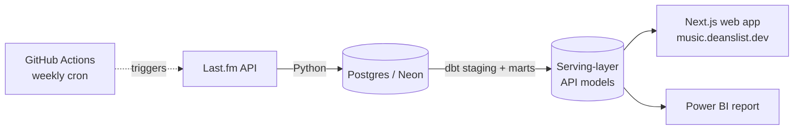

# music-growth-pipeline

**Do smaller independent artists grow their listener base faster than mainstream ones?**
A data pipeline + dbt project + public web app built on Last.fm data to find out — and a portfolio piece demonstrating SQL depth and data engineering fundamentals.

[](https://music.deanslist.dev)


## The Finding

Across 22,201 artists tracked over 13 weekly snapshots, **median listener growth falls monotonically with starting audience size**:

| Quintile (smallest → largest) | Q1 | Q2 | Q3 | Q4 | Q5 |
|---|---|---|---|---|---|
| Median 13-week growth | **2.67%** | 2.46% | 2.10% | 1.76% | **1.71%** |

No reversals at any step. Smaller artists also carry a much fatter upside tail — P90 growth in Q1 (16.88%) is over 4x Q5 (3.96%). Full breakdown, caveats, and a retracted earlier claim are in [Longitudinal Findings](#longitudinal-findings-2026-05-10-to-2026-08-02-13-weeks) below.

## Architecture



Ingestion snapshots each artist weekly since the API only returns cumulative all-time stats, not a time series. dbt builds the longitudinal dataset on top; the web app and Power BI report both read from a narrow, pre-joined serving layer — never straight from the marts.

## Research Question

Do smaller independent artists (ranked pages 500–2000 on the Last.fm global chart) have meaningfully different listener engagement patterns than mainstream artists (pages 1–50)? And over time, does chart position correlate with listener growth? Do genre and artist similarity network position play a role?

## Why This Design

Last.fm's `chart.getTopArtists` endpoint returns a current global ranking paginated across 2,000 pages. Pages 1–50 contain household names; pages 500–2000 contain smaller independent artists with real but modest audiences — an interesting population for engagement analysis.

Since the API only returns cumulative all-time stats (no built-in time series), the pipeline snapshots each artist weekly and builds its own longitudinal dataset. Cross-sectional analysis is available immediately; longitudinal analysis accumulates over time.

## Tech Stack

| Layer | Tool |
|---|---|
| Data source | Last.fm API (read-only, key auth) |
| Ingestion | Python |
| Storage | Postgres (hosted on Neon) |
| Transformation layer | dbt (dbt-postgres) |
| Analytical queries | SQL |
| Automation | GitHub Actions (weekly cron) |
| Reporting | Power BI (live Postgres connection to Neon) |
| Web app | Next.js 15 (App Router, TypeScript), deployed on Vercel |

## Schema

```
artists
  id, name, mbid, created_at

weekly_charts
  id, artist_id → artists, rank, page, snapshot_date

artist_snapshots
  id, artist_id → artists, listeners, playcount, snapshot_date

genres
  id, genre, fetched_at

genre_artists
  id, genre_id → genres, artist_id → artists, rank_in_genre, fetched_at

artist_similarities
  id, artist_id → artists, similar_artist_id → artists, similar_name,
  similar_mbid, similarity_score, fetched_at
```

## Repository Layout

```
pipeline/   Python ingestion — shared db.py / lastfm.py, seed scripts,
            weekly snapshot job, portfolio stats generator
dbt/        dbt project — dbt_project.yml, models/, analyses/, tests/,
            seeds/, macros/, snapshots/
sql/        Raw DDL — schema.sql (idempotent) and migrations/
docs/       Findings log and the web app implementation plan
data/       pipeline_stats.json, consumed by deanslist.dev at build time
web/        Next.js app — live at music.deanslist.dev
```

dbt commands take `--project-dir dbt`, or run them from inside `dbt/`.

## dbt Models

**Staging** — one model per source table, light renaming only. Defined in `dbt/models/staging/`.

**Marts:**

| Model | Description |
|---|---|
| `artist_tiers` | Classifies each artist as `mainstream` (min chart page ≤ 50) or `indie` |
| `genre_stats` | Per-genre summary: artist count, avg listeners, plays-per-listener ratio, mainstream vs indie breakdown |
| `artist_similarity_network` | Enriched similarity pairs with both artists' tier and a `cross_tier` / `same_tier` flag |
| `listener_growth` | Week-over-week listener delta per artist using `LAG` window function |
| `artist_growth_summary` | One row per artist: total growth, avg weekly %, weeks tracked |
| `weekly_growth_by_tier` | Aggregate week-over-week listener growth per tier — the time-series view of the core finding |
| `genre_growth` | Per-genre growth rates: avg and median total pct growth, avg weekly pct change |

**Serving layer** — `dbt/models/api/`, narrow pre-joined tables read by the web app's API routes. See [`docs/webapp-implementation-plan.md`](docs/webapp-implementation-plan.md).

## Key Findings (Snapshot: 2026-04-27)

Cross-sectional analysis comparing 250 mainstream artists (pages 1–50) vs 7,505 indie artists (pages 500–2000):

**Listener counts**
| Tier | Median listeners | P90 listeners |
|---|---|---|
| Mainstream | 3,323,634 | 5,887,602 |
| Indie | 240,361 | 782,674 |

The distributions do not overlap — the top 10% of indie artists (782K) fall well below the bottom 25% of mainstream artists (2.3M).

**Plays-per-listener ratio** (total plays ÷ total listeners)
| Tier | P25 | Median | P75 |
|---|---|---|---|
| Mainstream | 48.64 | 74.76 | 112.77 |
| Indie | 11.31 | 17.69 | 29.08 |

The mainstream median ratio (74.76) is ~4x higher than indie (17.69), consistent across the full distribution. Mainstream P25 (48.64) exceeds indie P75 (29.08).

*Caveat: mainstream artists have older catalogues on average, so accumulated playcounts likely contribute to the ratio gap alongside genuine engagement differences.*

**Genre breakdown (top 5 by avg listeners)**
| Genre | Avg listeners | Avg plays/listener | Mainstream | Indie |
|---|---|---|---|---|
| alternative | 1,878,778 | 41.83 | 64 | 167 |
| rock | 1,819,865 | 36.95 | 59 | 178 |
| pop | 1,635,383 | 55.79 | 81 | 152 |
| indie | 1,540,312 | 40.12 | 59 | 180 |
| hip-hop | 1,347,606 | 42.54 | 56 | 174 |

Pop shows the highest plays-per-listener ratio despite ranking third in avg listeners — pop fans replay more.

## Longitudinal Findings (2026-05-10 to 2026-08-02, 13 weeks)

22,201 artists tracked across 13 weekly snapshots.

**Growth rate by starting listener count (quintiles)**
| Quintile | Starting listeners | Artists | Avg Growth | Median Growth | P90 Growth |
|---|---|---|---|---|---|
| 1 (smallest) | 1 – 69,347 | 4,441 | 7.61% | 2.67% | 16.88% |
| 2 | 69,348 – 137,177 | 4,440 | 4.32% | 2.46% | 10.24% |
| 3 | 137,179 – 236,316 | 4,440 | 3.07% | 2.10% | 6.53% |
| 4 | 236,317 – 470,870 | 4,440 | 2.47% | 1.76% | 5.03% |
| 5 (largest) | 470,929 – 9,126,505 | 4,440 | 2.07% | 1.71% | 3.96% |

**Smaller artists grow faster, and the effect is monotonic** — median growth falls at every step from the smallest quintile to the largest, with no reversals. The spread between avg and median widens sharply at the small end (7.61% vs 2.67% in Q1, against 2.07% vs 1.71% in Q5): most small artists grow modestly, but a fat tail of fast-movers pulls the mean up. P90 growth in Q1 (16.88%) is over 4x that of Q5 (3.96%).

Artists are binned by their listener count *at the start* of the window rather than the end. Cutting on the end value would let the fastest growers migrate upward into larger quintiles, flattening the very gradient being measured.

> **Note on an earlier version of this finding.** This README previously reported growth increasing with *chart page depth* (mainstream 1.55% → underground 2.20%). That analysis inner-joined the chart table, so it silently excluded the ~12,000 artists with listener history but no chart position. Once those artists are included the tier ordering is non-monotonic and the claim does not hold. Listener count is the better size proxy: it is defined for every artist, continuous, and free of the chart's survivorship bias.

**Genre growth rates** (median 13-week listener growth, genres with >50 tracked artists)

EDM leads at 2.89% median growth, followed by pop (2.87%) and hip-hop (2.28%); classical trails at 1.22%, behind metal (1.32%) and punk (1.45%). Genre is a secondary effect — the spread across all 15 genres (1.22–2.89%) is narrower than the spread across size quintiles once the tail is accounted for.

**Standout artists**

Several small artists grew 100–400% over the window. Growth patterns split into two types: viral spike then deceleration (one-time moment), and steady week-over-week acceleration (sustained momentum).

*Caveat: Last.fm listener counts are cumulative all-time and can only increase — growth reflects new scrobblers, not active monthly listeners.*

## Setup

**Prerequisites:** Python 3.12+, PostgreSQL, a Last.fm API key, a Neon account (or any Postgres instance)

```bash
# Clone and set up environment (WSL/Linux)
git clone https://github.com/your-username/music-growth-pipeline
cd music-growth-pipeline
python3 -m venv .venv
source .venv/bin/activate
pip install -r requirements.txt

# Configure credentials
cp .env.example .env
# Edit .env: add LASTFM_API_KEY and DATABASE_URL

# Apply schema
psql $DATABASE_URL -f sql/schema.sql

# Seed artists (pages 500-2000 by default)
python pipeline/seed_artists.py

# Seed mainstream baseline
python pipeline/seed_artists.py --start 1 --end 50

# Take initial snapshot
python pipeline/snapshot_artists.py

# Seed genre and similarity data (one-time)
python pipeline/seed_genre_artists.py
python pipeline/seed_similar_artists.py

# Run dbt models
dbt run --project-dir dbt
```

Run the Python scripts from the repo root as shown — they locate `.env` by
walking up from their own directory, so running them from inside `pipeline/`
works too.

## Automation

A GitHub Action runs every Sunday at 9am UTC and chains four steps:
1. `pipeline/snapshot_artists.py` — snapshots all artists into Neon
2. `dbt run --project-dir dbt` — rebuilds all mart tables
3. `pipeline/generate_stats.py` — queries marts, writes `data/pipeline_stats.json`
4. `git push` — commits the updated JSON to this repo

[music.deanslist.dev](https://music.deanslist.dev) reads live from Postgres via the Next.js API routes, so it reflects new snapshots as soon as the weekly job lands (bounded by a 1-hour response cache). The portfolio site at [deanslist.dev](https://deanslist.dev) additionally fetches `pipeline_stats.json` at build time and rebuilds nightly at 3:30am UTC.

A Power BI report connects directly to the Neon database via a live Postgres connection and surfaces the core findings across two pages: an overview with growth trends by tier and genre, and an artist drillthrough showing individual listener timelines.

Required GitHub secrets: `LASTFM_API_KEY`, `DATABASE_URL`, `PROFANITY_PATTERN`.

## What's Next

- **Ingestion scale-up (Stage B)** — see [`docs/stage-b-plan.md`](docs/stage-b-plan.md)
- **Deeper longitudinal data** — snapshots continue accumulating weekly; more weeks will strengthen the growth rate findings and surface longer-term trends
- **Similarity network vs growth** — do indie artists with more cross-tier connections (similar to mainstream artists) grow faster? Currently limited by sparse similarity data for the highest-growth artists
</content>
